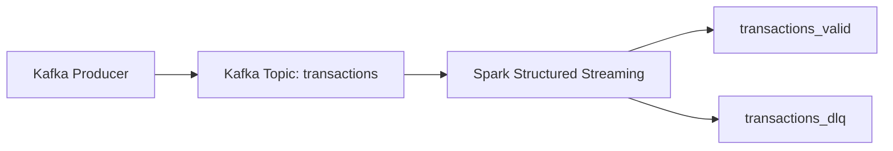

# End to End Kafka Spark Streaming Data 

## Project Description
This setup includes several required data tools, which are pulled via Docker from the following repository: https://github.com/salbifaza/data-engineer-toolkit.git

Simulating a streaming data pipeline that integrates data injection with automated processing using Kafka and Spark as the injection and  processing tools. The Kafka producer generates and injects dummy data that I created, following several data standardization rules.


## Tools 
### 1️⃣ airflow
`docker compose --profile airflow up -d`

### 2️⃣ grafana
`docker compose --profile grafana up -d`

### 3️⃣ postgres
`docker compose --profile postgres up -d`
or `docker compose --profile db up -d` (mysql + postgres)

### 4️⃣ mysql
`docker compose --profile mysql up -d`
or `docker compose --profile db up -d` (mysql + postgres)

### 5️⃣ hive
`docker compose --profile hive up -d`

### 6️⃣ kafka
`docker compose --profile kafka up -d`

### 7️⃣ spark
`docker compose --profile spark up -d`

## Prerequisites

Pastikan sudah terinstall:
- Docker
- Docker Compose

## Architecture



## Key Features

### Real-Time Streaming
- Continuous ingestion using Kafka
- Micro-batch processing via Spark Structured Streaming

### Data Validation Rules
- Mandatory field validation
- Type validation
- Value range validation
- Source validation (mobile, web, pos)

### Deduplication & Late Data Handling
- Event-time processing with watermarking
- Duplicate detection using `user_id` and event timestamp
- Late event handling within a 5-minute window

### Fault Isolation (DLQ)
- Invalid records are routed to a dedicated Kafka **dead-letter topic**
- Prevents bad data from polluting downstream systems

---

## How It Works

1. A Kafka producer continuously emits transaction events
2. Spark consumes the stream from Kafka
3. Each event is:
   - parsed and validated
   - enriched with event-time
   - deduplicated
4. Valid events are published to `transactions_valid`
5. Invalid events are published to `transactions_dlq`

---

## Sample Output

### Valid Event
```json
{
  "event_id": 1,
  "user_id": "U12345",
  "amount": 5000,
  "timestamp": "2025-12-28T11:50:00Z",
  "source": "mobile",
  "event_ts": "2025-12-28T11:50:00.000Z",
  "is_valid": true
}
```
### Invalid Event
```json
{
  "event_id": 11,
  "user_id": "U35342",
  "amount": 2000,
  "timestamp": "INVALID",
  "source": "tablet",
  "error_reason": "INVALID_TYPE; INVALID_SOURCE",
  "is_valid": false
}
```

## How to Run Locally
```
docker compose [tools] up -d
```
Tools can be replace with kafka or spark based on your needs.

```
docker exec -u root -it spark-master bash
cd /spark/dag/spark_jobs
spark-submit \
  --packages org.apache.spark:spark-sql-kafka-0-10_2.12:3.5.0 \
  kafka_transaction_validation.py
```
### Producer Kafka can be run locally
```
python producer1.py
```

## What This Project Demonstrates
- Real-time stream processing
- Event-time semantics
- Production-style Kafka + Spark integration
- Data quality enforcement at ingestion time
- Scalable streaming architecture design

**Author**
Natasha Dian
Data Engineer

